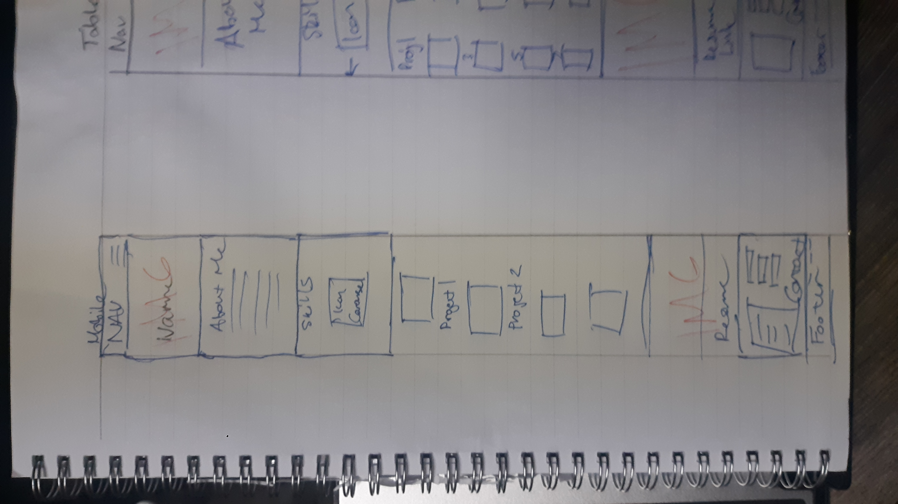
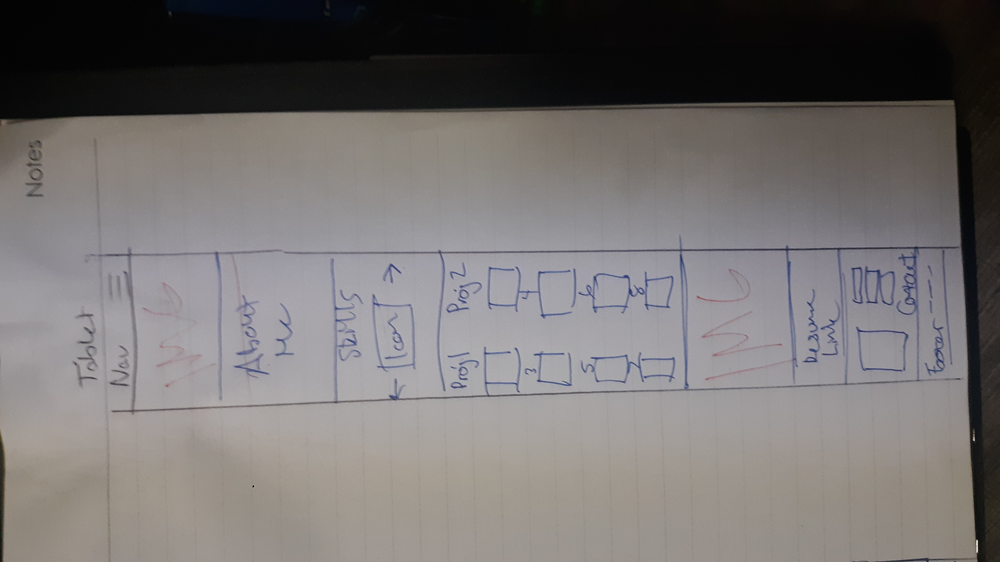
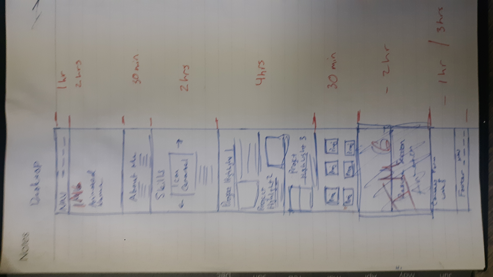

# Portfolio-Project-1
Unit 1 Project Portfolio
# Project Overview

## Project Schedule

|  Day | Deliverable | Status
|---|---| ---|
|Day 1| Project Description | Complete
|Day 1| Wireframes / Timeline | Complete
|Day 1| Core Application Structure (HTML, CSS, etc.) | Complete
|Day 2| Responsive Web Design | Complete
|Day 2| Extra elements and functionality | Complete
|Day 3| MVP, Animations, Bug Fixes | Complete
|Day 4| Implementing API | Incomplete
|Day 4| Final Touches | Incomplete
|Day 5| Present | Incomplete


## Project Description

I want a futuristic looking site with elegant colouring similar to [Brittany Chiang's Website]("https://brittanychiang.com/"). I want a fixed nav bar, 
an image animation similar to [Liana Penns Website]('https://www.lianapenn.com') , a skills icon carousel, a project highlight section with collapsible project descriptions, icons and resume link. 

## Wireframes





### MVP/PostMVP - 5min

#### MVP
- Base layout 
- Styling
- Icons
- Responsive
- Carousel

#### PostMVP 
- Hover Effects
- Dark/Light Mode
- Make Icon
- Bootstrap
- Sumbittable contact form (it will be there anyways, but needs to be submittable if time allows)
- API implementation


## Functional Components

#### MVP
| Component | Priority | Estimated Time | Actual Time |
| --- | :---: |  :---: | :---: | 
| Static nav-bar | H | 30min | .5hr |
| About Me Section | H | 30min | .2hr |  
| Project Highlight Section | H | 3.5hr| 3 hr |
| Animated Image - Top | M | 2hr | hr |
| Skills icon carousel | M | 2hr|  hr | 
| Responsive| M | 4hr | hr|
| Social Media Icons in footer | L | 1hr |  hr |
| Animated Image - Bottom| L | 2hr | hr |
| Contact Form | L | 4hr | hr |
| Total | H | 21.5hrs| hrs |

#### PostMVP
| Component | Priority | Estimated Time | Actual Time |
| --- | :---: |  :---: | :---: | 
| Hamburger | L | 1hrs|  hr | 
| Hover Effects | H | 1hr | hr | hr |
| Dark/Light Mode | H | 1hr | hr |
| Make Icon | H | 4hr | hr |
| Implement API | H | 2hr | hr |
| Total | H | 8hrs| hrs |
f
## Additional Libraries
| Library | Use |
| --- | :--: |
|Font Awesome | Skills/Social Media Icons

## Code Snippet

Use this section to include a brief code snippet of functionality that you are proud of an a brief description  

```
<!-- this code does a typewriter animation which i find beautiful its so simple  -->

let i = 0;
let txt = 'Hello, my name is Jason. I am a full-stack software engineer.';
let speed = 50;

function typeWriter() {
  if (i < txt.length) {
    document.getElementById("name").innerHTML += txt.charAt(i);
    i++;
    setTimeout(typeWriter, speed);
  }
}
```

## Issues and Resolutions
 Use this section to list of all major issues encountered and their resolution.

#### SAMPLE.....
**ERROR**: app.js:34 Uncaught SyntaxError: Unexpected identifier                                
**RESOLUTION**: Missing comma after first object in sources {} object
